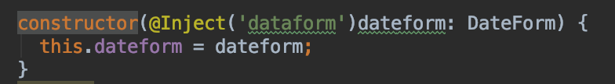
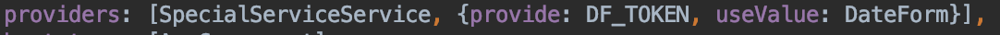
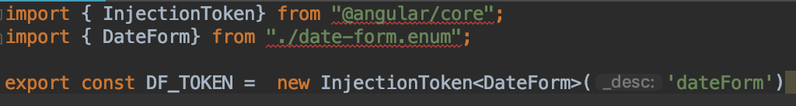
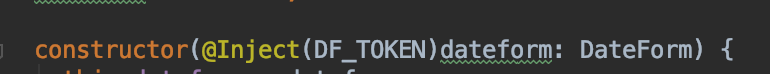
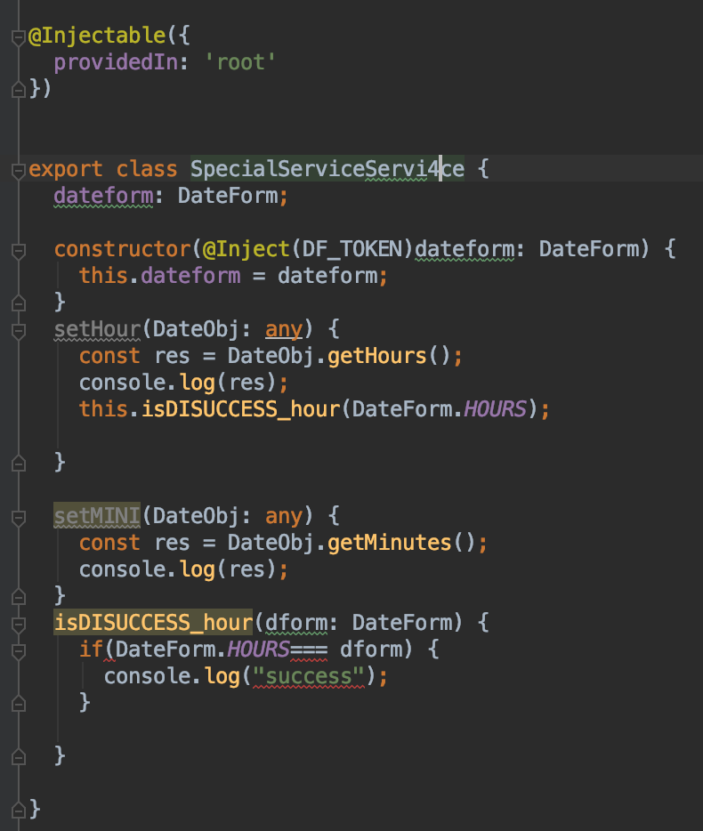
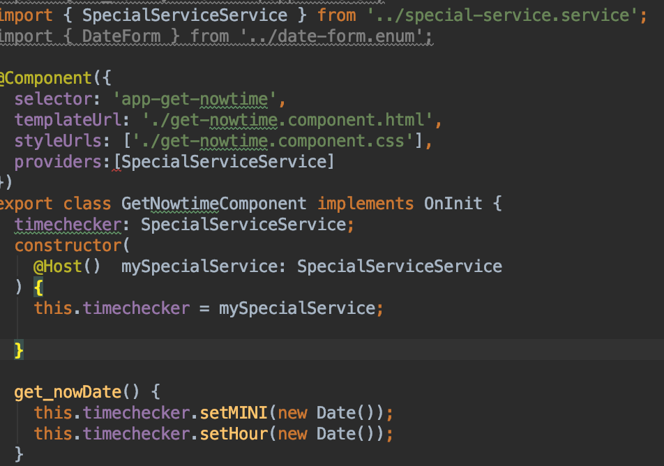
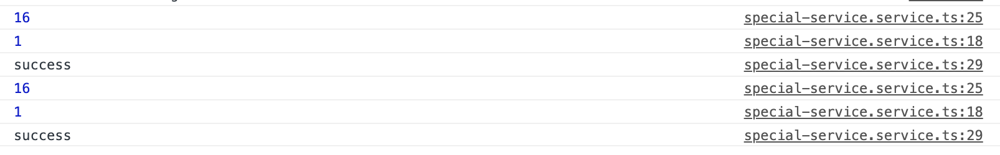

<h3>앵귤러에서 자식 컴포넌트 지정 및 접근 하기</h3>

앵귤러에서 자식 컴포넌트 객체를 지정하고 참조할 때, ViewChildren이라는 모듈을 import 하여 사용한다.

viewchildrean의 방식 외에도 자식으로 두고하자 하는 컴포넌트를 하위에 두고, 자식에 Input을 import하여 상위에서 받고자 하는 변수를 지정, 그리고 받고자하는 변수를 두고 상위 컴포넌트에서 자식으로 주고자하는 데이터를 지정하여 보내서 관리가 가능하다. 자식 컴포넌트 또한 어떠한 데이터를 처리하여 상위컴포넌트에 주고자 하려면 output 모듈을 import 그리고 데코레이터를 사용하여, 상위 컴포넌트로 보낼 변수를 지정하고 보내서 상호 통신이 가능하다. 하지만, 그렇게 되면, 부모-자손-자손의자손-자손의자손의자손-자손의자손의자손의자손 .... 에서 밑으로 내려갈 때마다, 그 아랫세대를 항상 거쳐야된다. 이런 구조는 코드가 더러워질 뿐 아니라, 퍼포먼스에도 큰 영향을 끼치게 되므로, Service를  통하여 하나의 객체를 두고 그 객체를 통하여 데이터를 주고받는 싱글턴 형식으로 서비를 하는것이 더 낫다. 이 싱글턴 방식은 퍼포먼스적으로도 이점이 있지만, 유지보수의 관점에서도 좋은 점이 한가지 더 있는데, 바로 하나의 객체를 사용하기 때문에, 어떠한 변경점에 대해서 다른 페이지나 컴포넌트로 가서 같이 따로 바꿔줄 필요가 없다는 것이다. 

다만 이러한 싱글턴도 문제점이 없지는 않은데, 프로젝트가 커지면 발생하는 문제이다. 모든 컴포넌트에 맞춰서 모든 케이스를 수용할수 있는 하나의 객체를 만들어야되고, 그에 따른 모든 컴포넌트에 객체를 가진 서비스를 줘야하는데, 이것은 단순 불편한 문제가 아니다. 어플리케이션의 의존성이 서비스 파일 하나에 비약적으로 높아지기 때문에 어플리케이션이 불안정해진다는 점이다. 이러한 문제는 앵귤러 뿐만 아니라, 다른 객체지향언어에서도 찿아볼수 있는데, 이러한 문제점에 대한 대안은 이미 오래전에 나왓다. 그것은 바로 의존성주입이다.

앵귤러js는 의존성 주입 기능을 제공하고 있다. 의존성 주입은, 각자 서로의 객체를 독립적으로 갖되, 인스턴스 요청이 있을때마다. 동일한 인스턴스를 주입하는 것이다.

<ol>
	<li>앵귤러의 데코레이터 중에 Inject 데코레이터가 있는데, 이것은 대상을 처리할 데이터가 있는 ts의 생성자에서 주입할 대상의 정보를 선언할때 사용한다 </li>
	<li>그 후 컴포넌트 모듈의 루트격에 해당하는 app.Moudule에서 providers로 이 객체를 어떻게 부를 것이고 취급할것인지 정해줘야된다.  뒤쪽의 {} json형식으로 지정해주면되고 provide는 키값, usevalue는 진짜 객체에 해당한다고 보면된다. 이미지의 DF_TOKEN이 있는데 이것은 
	에서 의존성 주입을 하고자하는 데이터에 대해 key값을 스트링으로 줄수도 있지만, 그럴경우, 외부 서비스에서 만약 다른 객체, 즉 다른객체이지만, 같은 키값을 가진 객체가 존재할 경우 충돌오류가 생길수 있으므로, 내부적으로 구분이 가능하도록 토크나이즈를 하는 것이다.
	 마찬가지로 서비스의 생성자부분도 바꿔준다.
	</li>
	<li>그 후 현재 시간을 불러오는 작업을 해주면서 HOurs를 함께 넘겨보면서 처음 의존성 주입을 대상으로 삼았던 객체의 활동 범위를 살펴 보자. 만약 성공적이라면 sucess가 같이 뜰것이고 그렇지 않다면, 시간과 분만 출력될 것이다.  
	시간을 받아 출력하게 하는 버튼을 가진 컴포넌트의 소스이다.
	
	</li>
	<li>출력결과는 
		 의도했던 대로 잘 나온다. 
		여기서 핵심은 Injection으로 모듈 설정및 appmoudule에 provider로써 json형식으로 추가하여 전 컴포넌트에서 키값으로 접근 할수 있게 해주는 것이고 Inject 데코레이터로 지정을 해서 받을때도 무엇을 받을 것인지 정해주는 것이다.
	</li>
</ol>