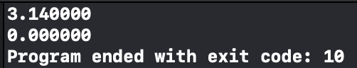

<h2>시스템 프로그래밍</h2>

<h3>개요</h3>

컴퓨터 프로그래밍은 추상화(abstraction)이 대부분이다. 

<h4>추상화의 예:</h4>
<ul>
<li>자료구조</li>
<li>가상메모리</li>
<li>스마트폰에 깔려있는 어플레이케이션 및 프로그램들 등</li>
</ul>

그러나 시스템 내부의 동작에 대한 필요가 있거나, 몇몇 자원이나 메모리 오류로 인해 발생되는 버그들을 추상화라는 솔루션으로 해결하기엔 한계가 있다. 시스템 프로그래밍의 이해함으로써 기과한 버그를퇴치, 프레임 워크 내부에서 일어나는 일들에 대해서 알수 있고, 성능과 자원의 한계를 고려한 프로그래밍이 가능하다.

<h3>알아두고 가야 할것1</h3>
<h4>Memory OverFlow Problem</h4>

*Rule:

<ul>
	<li>Integer: 4byte(32 bits)</li>
	<li>Range: -2^31 ~ 2^31-1</li>
</ul>

<strong>Code</strong> 
	void main(int argc, const char * argv[]) { 
    // insert code here... 
    float a = 1e20; 
    float b = -1e20; 
    float c = 3.14; 
    printf("%f \n",(a+b)+c); 
    printf("%f \n",a+(b+c)); 
} 
는 이렇다 결과는 

</img>

이렇게 나오는데. 그 이유는 1e20은 exp(E)의 20승이다. 이 거대한 숫자에 대해 ()연산을 해서 먼저 계산을 한다. 하지만 a와 b 는 서로 상반된 값으로 합을 구할시 0이 나오므로 뒤의 연산을 이어 하면, 나온 결과값이 3.14이므로 Integer 범위안에 표현이 되므로, 문제가 없다. 그러나 아래의 코드는 이미 범위를 넣은 값을 계산한 b+c연산을 한 시점에서 쓰레기값이 1차적으로 생기게된다. 거기에 다시 +a 연산을 하는데 이미 아무 의미없는 쓰레기 값에다가 값을 더하는 것이므로, 역시 쓰레기값이 남게되므로 0만 남게 된것이다.

<h3>알아두고 가야 할것2</h3>

*메모리 성능은 일정하지 않다.

WHY?

<ul>
	<li>1. cpu의 요청으로 메모리에서 특정 데이터를 참조한다.</li>
	<li>2. 참조한 데이터가 최초로 참조한 데이터 일시에, 다음에 또 참조할수 있으므로, cpu가 효율성을 위해 우선 캐시까지 가져가서 데이터를 등록한다.(매우느림)
	2-2. 최초로 참조하는 데이터의 주소가 아니고, 캐시에 그 데이터가 있을 경우, 메모리까지 가지 않고 캐시에서 꺼내어 사용한다.(매우 빠름)</li>
</ul>

즉, 메모리 성능은 비선형적으로 어떨때는 빠르고 어떨 때는 느릴 수 있다.

<h4>Memory Segmentation fault</h4>

<strong>Code</strong> 
	double fun(int i) {
    volatile double d[1] = {3.14}; 
    volatile long int a[2]; 
    a[i] = 1073741824; 
    return d[0]; 
}; 

int main(int argc, const char * argv[]) { 
    // insert code here... 
    printf("%lf \n",fun(0)); 
    printf("%lf \n",fun(1)); 
    printf("%lf \n",fun(2)); 
    return 0; 
} 
는 이렇다 결과는 

</img>

이렇게 나오는데, 설명을 하기전 volatile부터 보자면, 선언이 된 변수는 직접적인 메모리 접근이 있지않는 한, 한번 받은 값을 변경하지 않는 것이다. 
그렇게 매개변수로 받은 인덱스에 따른 배열에 1073741824라는 값을 대입하고 d를 리턴하는것이 주 동작 방식인데, 인덱스 2부터 다른 메모리로의 침범을 하게되면서 정상적인값이 아닌 다른값을 출력하게된다. 즉, 오류는 안나지만 할당된 메모리의 범위를 벗어나 다른 메모리에 그 값을 넣게 되는데 이것을 세그먼트 폴트라고 한다.

<h3>알아두고 가야 할것3</h3>
<h4>하드웨어 수준의 실행 프로세스의 이해</h4>

보통 하드웨어 수준의 low level에서는 어셈블리언어로 데이터 처리를 한다. 즉, 어셈블리어를 이해하는 것은, 하드웨어 수준의 실행모델을 이해하는데 매우 중요하다.

<h4>어셈블리어의 용도</h4>
<ul>
	<li>버그가 있을 때, 프로그램의 동작: 특정 시스템적인 버그는 고차원 언어 모델로는 들여다 볼수 없는 것들이 있다.</li>
	<li>프로그램의 성능을 튜닝할 때: 프로그램의 효율성을 이해하기 위해</li>
	<li>시스템 소프트웨어 구현시: 운영체제는 프로세스의 상태를 관리해야한다.</li>
	<li>멜웨어를 만들거나 멜웨어와 싸우기 위해</li>
</ul>

