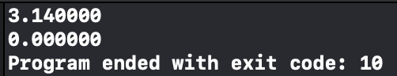

<h2>시스템 프로그래밍</h2>

<h3>개요</h3>

컴퓨터 프로그래밍은 추상화(abstraction)이 대부분이다. 

<h4>추상화의 예:</h4>
<ul>
<li>자료구조</li>
<li>가상메모리</li>
<li>스마트폰에 깔려있는 어플레이케이션 및 프로그램들 등</li>
</ul>

그러나 시스템 내부의 동작에 대한 필요가 있거나, 몇몇 자원이나 메모리 오류로 인해 발생되는 버그들을 추상화라는 솔루션으로 해결하기엔 한계가 있다. 시스템 프로그래밍의 이해함으로써 기과한 버그를퇴치, 프레임 워크 내부에서 일어나는 일들에 대해서 알수 있고, 성능과 자원의 한계를 고려한 프로그래밍이 가능하다.

<h3>알아두고 가야 할것1</h3>
<h4>Memory OverFlow Problem</h4>

*Rule:

<ul>
	<li>Integer: 4byte(32 bits)</li>
	<li>Range: -2^31 ~ 2^31-1</li>
</ul>

<strong>Code</strong>
	void main(int argc, const char * argv[]) {
    // insert code here...
    float a = 1e20;
    float b = -1e20;
    float c = 3.14;
    printf("%f \n",(a+b)+c);
    printf("%f \n",a+(b+c));
}

</img>

